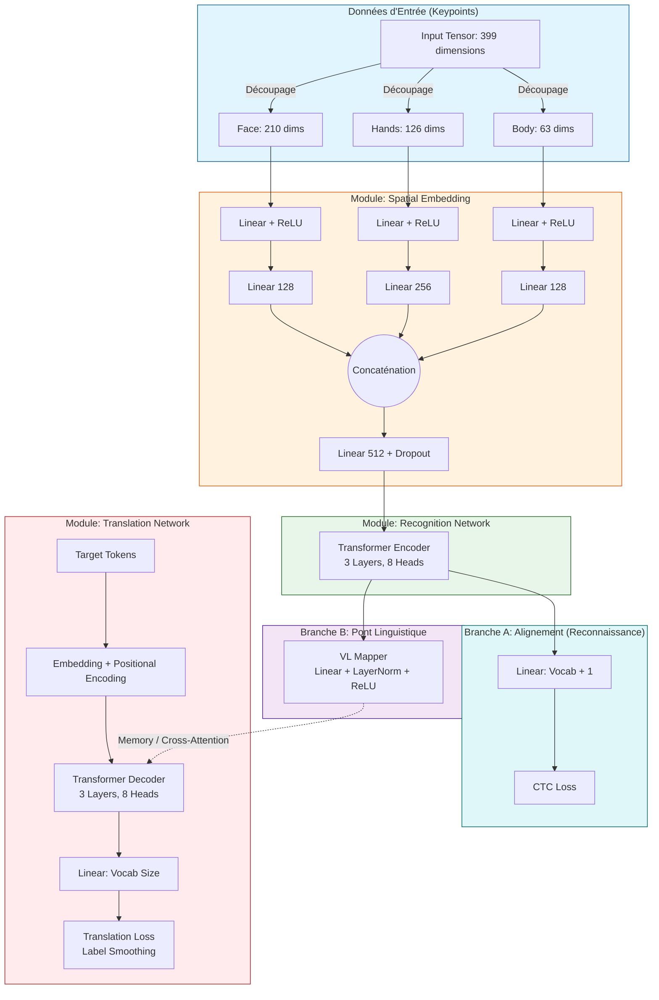

# Description Détaillée de l'Architecture (Pour Génération d'Image / Diagramme)

Voici un document ultra-détaillé qui décrit l'intégralité de l'architecture de votre modèle, couche par couche. 

J'ai inclus **3 choses** pour vous :
1. **Le "Prompt" exact** à copier-coller à une autre IA (comme ChatGPT) pour générer un schéma professionnel (Draw.io, TikZ, etc.).
2. **La description technique couche par couche** pour vous aider à la comprendre.
3. **Un diagramme directement généré ici** (format Mermaid) que vous pouvez visualiser et capturer en écran tout de suite !

---

## 1. Le Prompt à envoyer à une autre IA
*Si vous voulez qu'une autre IA vous fasse un schéma technique parfait, copiez-collez le texte suivant :*

> "Agis comme un expert en Deep Learning et en création de diagrammes d'architecture. Je veux que tu me génères le code pour un diagramme d'architecture (en PlantUML, TikZ ou Draw.io CSV) représentant mon réseau de Traduction de la Langue des Signes (CSLT). 
> Le flux d'information va de bas en haut (ou de gauche à droite). Voici les composants exacts dans l'ordre :
> 
> **1. INPUT:**
> - Entrée: 'Video Keypoints (Batch, Time, 399)'.
> - Séparation de l'entrée en 3 flux parallèles: 'Face (210 dims)', 'Hands (126 dims)', 'Body (63 dims)'.
> 
> **2. SPATIAL EMBEDDING MODULE (3 Flux parallèles):**
> - Face Stream: Linear(210 -> 256) -> ReLU -> Linear(256 -> 128).
> - Hand Stream: Linear(126 -> 256) -> ReLU -> Linear(256 -> 256).
> - Body Stream: Linear(63 -> 128) -> ReLU -> Linear(128 -> 128).
> - Fusion: Les 3 flux sont concaténés (Concat) -> Linear(512 -> 512) -> Dropout(0.1).
> 
> **3. RECOGNITION NETWORK (ENCODER):**
> - Prend la sortie de la fusion.
> - Module: 'Transformer Encoder' (3 Layers, 8 Attention Heads, d_model=512).
> - La sortie de cet encodeur se divise en DEUX branches (A et B).
> 
> **4. BRANCH A (Alignement CTC):**
> - Linear(512 -> Vocab_Size + 1).
> - Fonction de perte: 'CTC Loss' (calcule l'erreur entre les signes reconnus et les glosses cibles).
> 
> **5. BRANCH B (VL Mapper):**
> - Prend la sortie de l'encodeur.
> - Module 'Visual-Linguistic Mapper': Linear(512 -> 512) -> LayerNorm -> ReLU -> Dropout.
> - Sert de 'Memory' pour le décodeur.
> 
> **6. TRANSLATION NETWORK (DECODER):**
> - Entrée Textuelle: 'Target Text Tokens' -> Word Embedding -> Positional Encoding.
> - Module: 'Transformer Decoder' (3 Layers, 8 Attention Heads, d_model=512). Il effectue une Cross-Attention avec la 'Memory' venant du VL Mapper.
> - Sortie: Linear(512 -> Vocab_Size).
> - Fonction de perte: 'Translation Loss (Label Smoothing CrossEntropy)'.
> 
> Fais un diagramme propre, très hiérarchisé, montrant clairement les deux sorties (CTC Loss d'un côté, Translation Loss de l'autre)."

---

## 2. Diagramme Mermaid (Généré pour vous ici-même)
*Si votre lecteur Markdown le supporte, ce code affichera directement le diagramme ci-dessous.*

---

## 3. Explication "Couche par Couche" (Si on vous pose la question)

1. **La Couche d'Entrée (Input Layer) :** 
   Le modèle ne voit pas une image, il voit 399 chiffres à chaque instant. On a découpé ces chiffres pour que le modèle traite le visage (210 chiffres), les mains (126) et le corps (63) séparément, car chaque partie bouge différemment.
2. **Le Spatial Embedding (L'Extraction) :**
   C'est un réseau de neurones basique (`Linear` + `ReLU`) qui va analyser ces 3 flux séparément pour en extraire l'information utile, puis tout regrouper (`Concaténation`) dans un vecteur riche de 512 dimensions.
3. **Le Transformer Encoder (L'Observateur) :**
   Il prend cette information visuelle et regarde l'évolution dans le temps (grâce au mécanisme d'*Attention*). Il comprend la séquence des gestes.
4. **La "Double Sortie" (Multi-Task Learning) :**
   C'est la force de votre architecture ! La compréhension de l'encodeur est envoyée à deux endroits :
   - **En haut (CTC)** : On vérifie si l'encodeur a bien reconnu les signes un par un (Glosses). Ça aide l'encodeur à être très précis.
   - **Vers le VL Mapper** : On adapte l'information visuelle pour qu'elle devienne "lisible" par un cerveau linguistique.
5. **Le Transformer Decoder (Le Traducteur) :**
   Il prend les informations du `VL Mapper` et génère la phrase finale mot par mot. Il s'entraîne avec le `Label Smoothing Loss` pour éviter d'être trop confiant dans ses erreurs.
